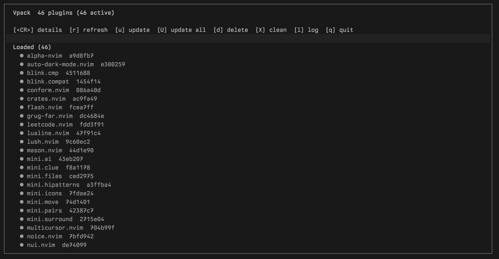

# vpack.nvim

Small UI for Neovim 0.12 `vim.pack`.

`vpack.nvim` gives you a simple `:Vpack` window for inspecting and operating on plugins managed by the built-in pack API.



## Requirements

- Neovim >= 0.12
- plugins managed through `vim.pack`

## Features

- list managed plugins
- show current revision and source/path details
- check loaded plugins for updates in the background
- show an `Updates available` section with incoming commits
- update current plugin
- update all checked plugins currently marked as available
- delete current plugin
- clean non-active plugins with `X`
- open `nvim-pack.log`
- auto-refresh on `PackChanged`
- reuse recent check results to avoid repeated fetches during refresh

## Install

### vim.pack

```lua
vim.pack.add({
  { src = "https://github.com/kouovo/vpack.nvim" },
})
```

## Setup

```lua
require("vpack").setup({
  window = {
    border = "rounded",
    width = 0.8,
    height = 0.8,
  },
  log = {
    path = vim.fs.joinpath(vim.fn.stdpath("log"), "nvim-pack.log"),
    border = "rounded",
    width = 0.8,
    height = 0.6,
  },
})
```

## Usage

Open the UI with:

```vim
:Vpack
```

## Keymaps

Inside the `:Vpack` window:

- `<CR>`: toggle details for current plugin
- `r`: refresh
- `c`: force a re-check for loaded plugins
- `u`: update current plugin
- `U`: update all checked plugins currently shown in `Updates available`
- `d`: delete current plugin
- `X`: clean non-active plugins
- `l`: open `nvim-pack.log`
- `q`: close

Inside the log window:

- `G`: jump to bottom
- `q`: close

## Notes

- opening `:Vpack` starts a background check for loaded plugins; refresh reuses recent check results when possible.
- `c` forces a fresh check and updates the `Updates available` section.
- `U` only updates plugins that were already checked and marked as having updates.
- `delete` removes the package from disk; it does not edit your config.
- `clean` removes all non-active packages currently reported by `vim.pack.get()`.
- already-loaded plugins may still affect the current session until restart.
- colors follow your existing highlight groups.
